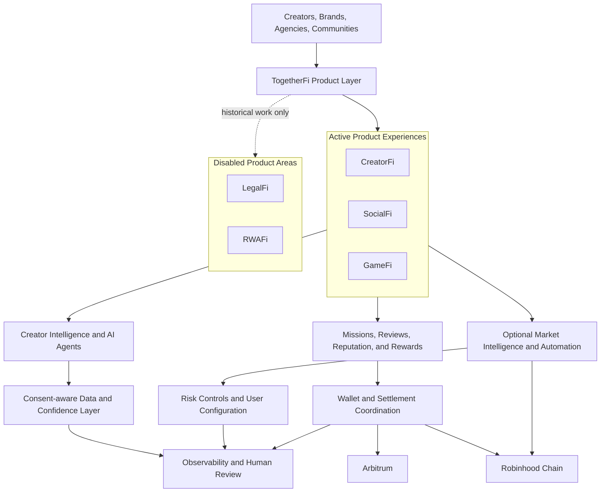

# Platform Architecture

This is a deliberately high-level view. It shows product boundaries and engineering scope without revealing source, contract design, deployable interfaces, private data structures, or operational controls.

## Product layer

### CreatorFi

CreatorFi supports the lifecycle from brand or agency intent through creator discovery, applications, review, delivery, and compensation. The private implementation includes workflow and settlement safeguards that are intentionally not documented here.

### SocialFi

SocialFi connects social participation with missions, evidence, attestations, status tracking, notifications, and reward outcomes. Participant identities, anti-abuse logic, payout rules, and verification methods remain private.

### GameFi

GameFi supports community gaming experiences, mission participation, raffles, event coordination, and prize workflows. Individual winners, payout records, and abuse-prevention controls are not public.

### LegalFi (disabled)

LegalFi documents earlier research into AI-assisted document review. It is disabled and is not available in the live app.

### RWAFi (disabled)

RWAFi documents earlier research into partner-oriented workflows. It is disabled and is not available in the live app.

## Intelligence and AI layer

Creator Intelligence connects signals from multiple creator platforms, normalizes them, attaches confidence and explainability, and supports discovery and matching. The snapshot covers eleven target platforms and seven documented live adapters.

The platform also contains more than ten specialized AI agents supporting creator, legal, real-world-asset, and operational workflows. Prompts, permissions, scoring formulas, model-routing logic, and private outputs are excluded.

## Chain layer

### Arbitrum

Arbitrum is used for settlement-oriented platform capabilities including funded campaigns, mission rewards, attestations, reputation records, and revenue accounting. Capabilities are released in stages, and the presence of implementation work does not mean every surface is active on mainnet.

### Robinhood Chain

Robinhood Chain is a separate product and market context covering creator ecosystems, chain-specific rewards, asset movement, pool discovery, token safety, market signals, and optional automation. Availability, liquidity, and trading outcomes are never guaranteed.

## Reliability principles

- On-chain state is reconciled rather than assumed
- Financial actions are designed for idempotency and explicit status tracking
- Chain and asset contexts remain separated
- Human review remains available for high-impact AI decisions
- Consent and disclosure boundaries protect creator and partner information
- Automated trading is optional, configurable, and risk-forward
- Production claims require stronger evidence than local or test-environment results
